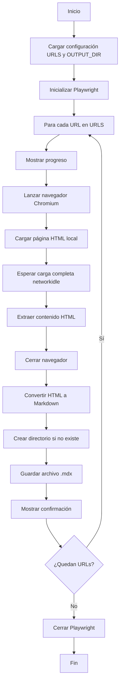

# 🔍 ANÁLISIS COMPLETO DEL CÓDIGO: index.py
## Extractor de Contenido HTML a Markdown con Playwright

---

## 📋 Resumen Técnico del Archivo

**Tipo de aplicación:** Script de web scraping y conversión de archivos  
**Lenguaje:** Python 3.x  
**Propósito:** Extraer contenido HTML de archivos locales y convertirlo a formato Markdown  
**Arquitectura:** Funcional con operaciones asíncronas  
**Dominio:** Procesamiento de contenido educativo (curso ADSO)  

---

## 🛠️ Tecnologías Utilizadas

### Dependencias Principales:
1. **asyncio** - Biblioteca nativa para programación asíncrona
2. **playwright** - Framework moderno para automatización web (v1.x+)
3. **markdownify** - Conversor de HTML a Markdown
4. **os** - Biblioteca nativa para operaciones del sistema operativo

### Versiones Recomendadas:
```
playwright>=1.40.0
markdownify>=0.11.6
```

---

## 🏗️ Estructura del Proyecto

```
index.py
├── CONFIGURACIÓN
│   ├── URLS[] - Lista de rutas de archivos HTML locales
│   └── OUTPUT_DIR - Directorio de salida
├── FUNCIONES
│   ├── extraer_contenido() - Función asíncrona para extracción HTML
│   └── convertir_y_guardar_html_a_markdown() - Función sincrónica de conversión
└── FLUJO PRINCIPAL
    └── main() - Función principal asíncrona
```

---

## 📖 Documentación del Código Fuente

### 1. SECCIÓN DE CONFIGURACIÓN

```python
URLS = [lista_de_rutas_html]
OUTPUT_DIR = "ruta_de_salida"
```

**Propósito:** Define las constantes de configuración del script.

**Análisis detallado:**
- `URLS`: Lista de 5 rutas de archivos HTML locales que apuntan a diferentes secciones de un curso ADSO
- `OUTPUT_DIR`: Ruta absoluta donde se guardarán los archivos convertidos
- **Estructura de URLs:** Todas siguen el patrón `file:///{ruta_absoluta}/index.html#{seccion}`
- **Temática:** Contenido educativo sobre "Caracterización de procesos"

**⚠️ Limitaciones identificadas:**
- Rutas hardcodeadas específicas para un usuario (frlpi)
- No es portable entre sistemas
- Dependiente de la estructura de carpetas de OneDrive

---

### 2. FUNCIÓN `extraer_contenido()`

```python
async def extraer_contenido(playwright, ruta_local):
    browser = await playwright.chromium.launch()
    context = await browser.new_context()
    page = await context.new_page()
    
    await page.goto(ruta_local, wait_until="networkidle")
    content = await page.content()
    
    await browser.close()
    return content
```

**Propósito:** Extrae el contenido HTML completo de un archivo local usando Playwright.

**Análisis técnico:**
- **Parámetros:**
  - `playwright`: Instancia del framework Playwright
  - `ruta_local`: URL del archivo HTML local a procesar
- **Retorno:** String con el contenido HTML completo
- **Proceso:**
  1. Lanza navegador Chromium
  2. Crea nuevo contexto (aislamiento)
  3. Crea nueva página
  4. Navega a la URL con espera `networkidle` (espera a que no haya actividad de red)
  5. Extrae contenido HTML completo
  6. Cierra navegador

**🔧 Fortalezas:**
- Uso de `wait_until="networkidle"` asegura que el contenido dinámico se cargue
- Gestión adecuada del ciclo de vida del navegador
- Aislamiento de contexto para seguridad

**⚠️ Puntos de mejora:**
- No hay manejo de errores (conexión, archivos inexistentes)
- Crea y cierra navegador en cada iteración (ineficiente)
- No hay timeouts configurados

---

### 3. FUNCIÓN `convertir_y_guardar_html_a_markdown()`

```python
def convertir_y_guardar_html_a_markdown(html_content, nombre_archivo):
    markdown = md(html_content, strip=['script', 'style'])
    os.makedirs(OUTPUT_DIR, exist_ok=True)
    ruta_archivo = os.path.join(OUTPUT_DIR, nombre_archivo)
    with open(ruta_archivo, "w", encoding="utf-8") as f:
        f.write(markdown)
    print(f"✅ Archivo guardado en: {ruta_archivo}")
```

**Propósito:** Convierte HTML a Markdown y guarda el resultado en archivo.

**Análisis técnico:**
- **Parámetros:**
  - `html_content`: Contenido HTML a convertir
  - `nombre_archivo`: Nombre del archivo de salida
- **Proceso:**
  1. Convierte HTML a Markdown eliminando scripts y estilos
  2. Crea directorio de salida si no existe
  3. Construye ruta completa del archivo
  4. Guarda contenido con codificación UTF-8
  5. Muestra confirmación en consola

**🔧 Fortalezas:**
- Usa `strip=['script', 'style']` para limpiar elementos no deseados
- Manejo correcto de encoding UTF-8
- Crea directorio automáticamente
- Feedback visual al usuario

**⚠️ Puntos de mejora:**
- No valida si el archivo ya existe
- No hay manejo de errores de escritura
- Sobrescribe archivos existentes sin aviso

---

### 4. FUNCIÓN PRINCIPAL `main()`

```python
async def main():
    async with async_playwright() as playwright:
        for i, ruta_local in enumerate(URLS, start=1):
            print(f"Procesando archivo {i} / {len(URLS)}: {ruta_local}")
            html = await extraer_contenido(playwright, ruta_local)
            nombre_archivo = f"contenido_{i}.mdx"
            convertir_y_guardar_html_a_markdown(html, nombre_archivo)
```

**Propósito:** Coordina la extracción y conversión de todos los archivos.

**Análisis técnico:**
- **Flujo de ejecución:**
  1. Inicializa Playwright en contexto asíncrono
  2. Itera sobre todas las URLs
  3. Muestra progreso en consola
  4. Extrae contenido HTML
  5. Genera nombre de archivo secuencial
  6. Convierte y guarda como .mdx

**🔧 Fortalezas:**
- Uso correcto de context manager `async with`
- Progreso visual con numeración
- Nombres de archivo sistemáticos
- Procesamiento secuencial ordenado

**⚠️ Puntos de mejora:**
- Procesamiento secuencial (podría ser paralelo)
- No hay manejo de errores globales
- Extensión .mdx sin configurar sintaxis específica

---

## 🎯 Flujo Lógico del Sistema



---

## 🚨 Detección de Posibles Bugs y Áreas de Riesgo

### 1. **Riesgo Alto - Rutas Hardcodeadas**
```python
# PROBLEMA
URLS = ["file:///C:/Users/frlpi/OneDrive/..."]
OUTPUT_DIR = "C:/Users/frlpi/OneDrive/Escritorio/scraper"
```
**Impacto:** El código solo funciona en el sistema específico del usuario.

### 2. **Riesgo Medio - Sin Manejo de Errores**
```python
# PROBLEMA: Sin try-catch
await page.goto(ruta_local, wait_until="networkidle")
```
**Impacto:** El script se detiene completamente si un archivo no existe.

### 3. **Riesgo Medio - Ineficiencia de Recursos**
```python
# PROBLEMA: Crear/cerrar navegador en cada iteración
browser = await playwright.chromium.launch()
# ... procesamiento ...
await browser.close()
```
**Impacto:** Desperdicio de recursos y tiempo de procesamiento.

### 4. **Riesgo Bajo - Sobrescritura de Archivos**
```python
# PROBLEMA: No valida archivos existentes
with open(ruta_archivo, "w", encoding="utf-8") as f:
    f.write(markdown)
```
**Impacto:** Pérdida de archivos convertidos previamente.

---

## 💡 Recomendaciones de Mejora

### 1. **Configuración Dinámica**
```python
# MEJORA SUGERIDA
import argparse
import json

def cargar_configuracion():
    parser = argparse.ArgumentParser()
    parser.add_argument("--config", default="config.json")
    args = parser.parse_args()
    
    with open(args.config, 'r') as f:
        return json.load(f)
```

### 2. **Manejo Robusto de Errores**
```python
# MEJORA SUGERIDA
async def extraer_contenido_seguro(playwright, ruta_local):
    try:
        browser = await playwright.chromium.launch()
        context = await browser.new_context()
        page = await context.new_page()
        
        await page.goto(ruta_local, wait_until="networkidle", timeout=30000)
        content = await page.content()
        
        await browser.close()
        return content
    except Exception as e:
        print(f"❌ Error procesando {ruta_local}: {e}")
        return None
```

### 3. **Optimización de Recursos**
```python
# MEJORA SUGERIDA
async def main_optimizado():
    async with async_playwright() as playwright:
        browser = await playwright.chromium.launch()
        context = await browser.new_context()
        
        for url in URLS:
            page = await context.new_page()
            # ... procesamiento ...
            await page.close()
            
        await browser.close()
```

### 4. **Logging Profesional**
```python
# MEJORA SUGERIDA
import logging

logging.basicConfig(
    level=logging.INFO,
    format='%(asctime)s - %(levelname)s - %(message)s',
    handlers=[
        logging.FileHandler('scraper.log'),
        logging.StreamHandler()
    ]
)
```

---

## 📚 Manual de Uso Detallado

### Requisitos Previos

#### 1. **Instalación de Python**
- Python 3.7 o superior
- pip (gestor de paquetes)

#### 2. **Instalación de Dependencias**
```bash
# Instalar playwright
pip install playwright

# Instalar navegadores de playwright
playwright install

# Instalar markdownify
pip install markdownify
```

#### 3. **Verificación de Archivos HTML**
- Asegúrate de que los archivos HTML existan en las rutas especificadas
- Los archivos deben ser accesibles localmente

---

### Pasos de Instalación y Configuración

#### **Paso 1: Preparar el Entorno**
```bash
# Crear directorio del proyecto
mkdir html-to-markdown-scraper
cd html-to-markdown-scraper

# Crear entorno virtual (recomendado)
python -m venv venv
source venv/bin/activate  # Linux/Mac
# o
venv\Scripts\activate  # Windows
```

#### **Paso 2: Instalar Dependencias**
```bash
pip install playwright markdownify
playwright install chromium
```

#### **Paso 3: Configurar Rutas**
Edita el archivo `index.py` y modifica las siguientes variables:

```python
# PERSONALIZA ESTAS RUTAS
URLS = [
    "file:///ruta/a/tu/archivo1.html",
    "file:///ruta/a/tu/archivo2.html",
    # ... más archivos
]

OUTPUT_DIR = "/ruta/a/tu/directorio/salida"
```

#### **Paso 4: Ejecutar el Script**
```bash
python index.py
```

---

### Explicación de Cada Parte Funcional

#### **1. Configuración de URLs**
```python
URLS = [...]  # Lista de archivos a procesar
```
**Función:** Define qué archivos HTML procesar  
**Modificación:** Cambia las rutas por las de tus archivos  
**Formato:** Debe usar protocolo `file://` para archivos locales  

#### **2. Directorio de Salida**
```python
OUTPUT_DIR = "ruta/salida"
```
**Función:** Define dónde guardar los archivos convertidos  
**Modificación:** Cambia por tu directorio preferido  
**Comportamiento:** Se crea automáticamente si no existe  

#### **3. Extracción de Contenido**
```python
async def extraer_contenido(playwright, ruta_local)
```
**Función:** Abre archivos HTML y extrae su contenido completo  
**Personalización:** Modifica `wait_until` si tus archivos cargan diferente  
**Opciones de espera:** `"load"`, `"domcontentloaded"`, `"networkidle"`  

#### **4. Conversión a Markdown**
```python
def convertir_y_guardar_html_a_markdown(html_content, nombre_archivo)
```
**Función:** Convierte HTML a Markdown y guarda el archivo  
**Personalización:** Modifica el parámetro `strip` para elementos diferentes  
**Ejemplo:** `strip=['script', 'style', 'nav', 'footer']`  

---

### Cómo Extender o Modificar Funciones

#### **1. Agregar Más Archivos**
```python
# Método 1: Editar lista directamente
URLS = [
    "file:///archivo1.html",
    "file:///archivo2.html",
    "file:///nuevo_archivo.html",  # NUEVO
]

# Método 2: Cargar desde archivo
def cargar_urls_desde_archivo(archivo_config):
    with open(archivo_config, 'r') as f:
        return [line.strip() for line in f if line.strip()]
```

#### **2. Cambiar Formato de Salida**
```python
# Para HTML limpio en lugar de Markdown
def guardar_como_html(html_content, nombre_archivo):
    # Limpiar HTML innecesario
    from bs4 import BeautifulSoup
    soup = BeautifulSoup(html_content, 'html.parser')
    
    # Remover elementos no deseados
    for script in soup(["script", "style"]):
        script.decompose()
    
    # Guardar HTML limpio
    ruta_archivo = os.path.join(OUTPUT_DIR, f"{nombre_archivo}.html")
    with open(ruta_archivo, "w", encoding="utf-8") as f:
        f.write(str(soup))
```

#### **3. Agregar Filtros de Contenido**
```python
def filtrar_contenido(html_content):
    from bs4 import BeautifulSoup
    soup = BeautifulSoup(html_content, 'html.parser')
    
    # Ejemplo: Solo extraer contenido de divs con clase específica
    contenido_filtrado = soup.find_all('div', class_='contenido-principal')
    
    return str(contenido_filtrado) if contenido_filtrado else html_content
```

#### **4. Procesamiento Paralelo**
```python
import asyncio

async def procesar_url_individual(playwright, url, indice):
    """Procesa una URL individual"""
    try:
        html = await extraer_contenido(playwright, url)
        nombre_archivo = f"contenido_{indice}.mdx"
        convertir_y_guardar_html_a_markdown(html, nombre_archivo)
        return f"✅ Procesado: {url}"
    except Exception as e:
        return f"❌ Error en {url}: {e}"

async def main_paralelo():
    """Versión paralela del procesamiento"""
    async with async_playwright() as playwright:
        tareas = [
            procesar_url_individual(playwright, url, i+1) 
            for i, url in enumerate(URLS)
        ]
        
        resultados = await asyncio.gather(*tareas)
        for resultado in resultados:
            print(resultado)
```

---

### Preguntas Frecuentes (FAQ)

#### **Q: ¿Por qué uso Playwright en lugar de requests?**
**R:** Playwright puede manejar JavaScript y contenido dinámico que requests no puede procesar. Es ideal para páginas web modernas con contenido que se carga dinámicamente.

#### **Q: ¿Puedo procesar páginas web remotas?**
**R:** Sí, solo cambia las URLs de `file://` a `https://`. Por ejemplo:
```python
URLS = [
    "https://example.com/page1",
    "https://example.com/page2",
]
```

#### **Q: ¿Cómo manejo sitios que requieren autenticación?**
**R:** Agrega configuración de contexto:
```python
context = await browser.new_context(
    extra_http_headers={"Authorization": "Bearer token"}
)
```

#### **Q: ¿Qué hago si el script es muy lento?**
**R:** Implementa la versión paralela mostrada arriba o reduce el `wait_until`:
```python
await page.goto(ruta_local, wait_until="domcontentloaded")
```

#### **Q: ¿Cómo personalizo el formato Markdown?**
**R:** Usa opciones adicionales de markdownify:
```python
markdown = md(html_content, 
    strip=['script', 'style'],
    convert=['p', 'h1', 'h2', 'h3', 'ul', 'ol', 'li'],
    heading_style='ATX'  # Para headers con #
)
```

---

### Estructura de Archivos de Salida

Los archivos generados seguirán este patrón:
```
/directorio_salida/
├── contenido_1.mdx  (Introducción)
├── contenido_2.mdx  (Tema 1)
├── contenido_3.mdx  (Tema 2)
├── contenido_4.mdx  (Tema 3)
└── contenido_5.mdx  (Tema 4)
```

Cada archivo contendrá el contenido HTML convertido a Markdown, sin scripts ni estilos CSS.

---

## 🏆 Conclusión

Este script es una herramienta funcional y bien estructurada para convertir contenido HTML local a formato Markdown. Es especialmente útil para procesar contenido educativo o documentación web en lotes.

**Fortalezas principales:**
- Arquitectura limpia y modular
- Uso correcto de async/await
- Manejo adecuado de encoding UTF-8
- Feedback visual al usuario

**Áreas de mejora prioritarias:**
- Implementar manejo robusto de errores
- Hacer configuración portable y dinámica  
- Optimizar uso de recursos del navegador
- Agregar logging profesional

Con las mejoras sugeridas, este script puede evolucionar hacia una herramienta de producción robusta y reutilizable.